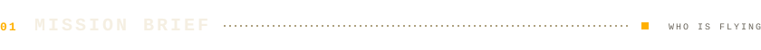
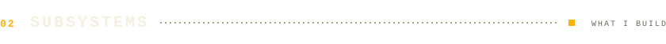
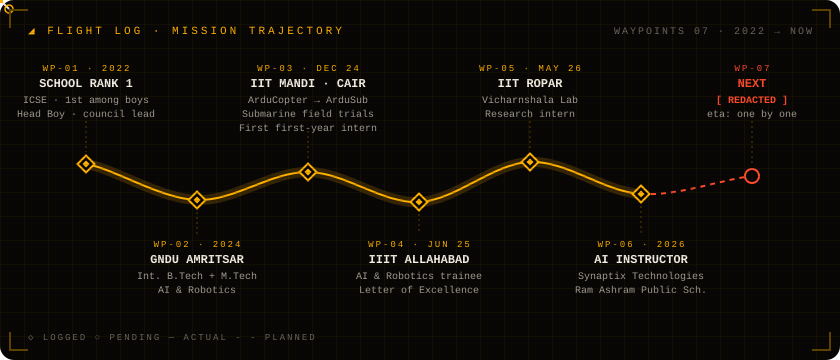
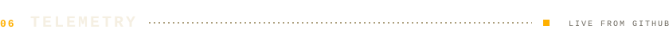

<!--
  ┌───────────────────────────────────────────────────────────┐
  │  GS-13 · GROUND CONTROL — profile of Gurnoor Singh          │
  │  All visuals in /assets are hand-built animated SVGs        │
  │  (regenerate with: python3 build.py)                        │
  └───────────────────────────────────────────────────────────┘
-->

<a href="https://gurnoorsingh.in"></a>

<p align="center">
  <a href="https://gurnoorsingh.in"></a>
  <a href="https://www.linkedin.com/in/gurnoorsingh"></a>
  <a href="mailto:er.gurnoorsingh@gmail.com"></a>
  
</p>

<br/>



> **I build machines that see, decide and move** — in the air, underwater and on the ground — and I teach others to do the same.

I'm a third-year **Integrated B.Tech + M.Tech student in AI & Robotics** at Guru Nanak Dev University, Amritsar, with research experience across three national institutes: **IIT Ropar, IIT Mandi and IIIT Allahabad**.

At **IIT Mandi's CAIR Lab** — as the first first-year intern in the lab's history — I adapted ArduCopter firmware for underwater robots with ArduSub and led field trials of a custom-built submarine. Today I'm a **research intern at IIT Ropar's Vicharnshala Lab**, building **RAG systems and LLM-powered applications**, and working as an **AI instructor** for both school students and professional teams.

Outside the lab: President of the **ATAL Tinkering Lab**, Campus Ambassador for **Innovation Mission Punjab**, and main organizer of **TechnoVista 2.0**. Something new is also being built in the background — it ships when it's ready.

<br/>





<br/><br/>




<details>
<summary><b>Open full mission log</b></summary>
<br/>

**Research Intern — Vicharnshala Lab, IIT Ropar** · `May 2026 – present`
- Design, experimentation and prototyping across AI and robotics workstreams.
- Building and validating embedded control and perception routines — turning research concepts into working hardware and software demonstrators.

**AI Instructor — Synaptix Technologies** · `Jul 2026 – present`
- Design and deliver applied AI/ML training modules, hands-on labs and assessments for learners and professional teams.
- Mentor participants through end-to-end projects: data handling, model development, evaluation.

**AI Instructor — Ram Ashram Public School, Amritsar** · `May 2026 – present`
- Teach AI, ML and computational thinking through a project-driven curriculum; guide student teams for exhibitions and innovation projects.

**Summer Trainee, AI & Robotics — IIIT Allahabad** · `Jun – Jul 2025`
- Intensive programme in ML, perception and autonomous system design, ending in a project demonstration.
- Awarded a **Letter of Excellence** for outstanding performance.

**Firmware & Robotics Research Intern — CAIR, IIT Mandi** · `Dec 2024 – Jan 2025`
- Adapted ArduCopter firmware logic for underwater robotics using ArduSub — firmware architecture, AHRS, comms protocols, error handling, data logging.
- Traced the full code flow, found critical bugs and tuned control parameters for better stability.
- Led real-world field testing of a custom submarine robot, improving navigation accuracy; designed and 3D-printed structural parts.

**Education**
- Integrated B.Tech + M.Tech, AI & Robotics — Guru Nanak Dev University · `2024 – present`
- Higher Secondary (PCMB), CBSE — Sant Singh Sukha Singh Modern High School · `2024`
- Secondary (Science), ICSE — Sri Guru Harkrishan Public School · `2022` · **ranked 1st among boys**

</details>

<br/>


<table>
<tr>
<td width="160"><code>CORE</code></td>
<td></td>
</tr>
<tr>
<td><code>INTELLIGENCE</code></td>
<td>
<br/>


</td>
</tr>
<tr>
<td><code>FLIGHT &amp; FIELD</code></td>
<td>
<br/>


</td>
</tr>
<tr>
<td><code>FABRICATION</code></td>
<td>


</td>
</tr>
<tr>
<td><code>GROUND OPS</code></td>
<td>
<br/>


</td>
</tr>
</table>

<br/>


<table>
<tr>
<td width="50%" valign="top">

**`COMMAND`**

- **Campus Ambassador** — Innovation Mission Punjab, Govt. of Punjab
- **President** — ATAL Tinkering Lab
- **Main Organizer** — TechnoVista 2.0, university-wide tech fest
- **Event Coordinator** — Engineers' Week, GNDU
- **Head Boy & Student Council President** — led a 14-member council
- Ran a **3-day ATAL Lab training programme for faculty**
- Presented to an **ISRO scientist** on National Space Day

</td>
<td width="50%" valign="top">

**`HONORS`**

```diff
+ Letter of Excellence     IIIT Allahabad
+ 1st  State-level tech presentation (Prayas)
+ 1st  "I Am an Engineer" technical skills
+ 1st  Intra-department debate championship
+ 2nd  Inter-department tech presentation
+ 2nd  Inter-college debate "Fusion"
+ 3rd  Science model exhibition (70+ teams)
+ Excellence Award — Academics & Leadership
```

</td>
</tr>
</table>

<details>
<summary><b>More honors, training &amp; engagements</b></summary>
<br/>

**Honors** — 2nd place, Group Discussion (₹2,100 prize) · Runner-up, Technical Paper Reading · High Commendation, Youth Parliament, GNDU · 1st place, Religious Poetry Recitation · Best Camper, Chief Khalsa Diwan Leadership Development Program

**In training** — Aerial Robotics Specialization, University of Pennsylvania (Coursera) · Data Science, ML, DL & NLP (Krish Naik, Udemy) · SolidWorks Professional, Advanced CAD

**Workshops** — ROS & Advanced Robotics (3 days, GJCEI) · Autodesk Fusion 360 Professional (3 days) · Web3 & Blockchain (StarkNet Developer Program) · IoT Systems (ESF, GNDU) · "AI in Action" executive workshop · ETSSA 2025 Smart Agriculture Conclave, PAU Ludhiana · C & C++ Programming certification

**On stage** — 3D printing demo at Khalsa Science Festival · Startup pitch at IT Utsav · Guest speaker on entrepreneurship · Official anchor, Punjab International Trade Expo (PITEX) · Exhibition coordinator, Festival of Science · Google DevFest Punjab

</details>

<br/>



<p align="center">
  
  
</p>


<br/>


```yaml
accepting:  research collaborations · internships · roles in autonomous systems & applied AI
interests:  underwater + aerial autonomy · RAG & LLM systems · AI education
response:   fast — quickest via email
```

<p align="center">
  <a href="https://gurnoorsingh.in"></a>
  <a href="https://www.linkedin.com/in/gurnoorsingh"></a>
  <a href="mailto:er.gurnoorsingh@gmail.com"></a>
</p>

<br/>


